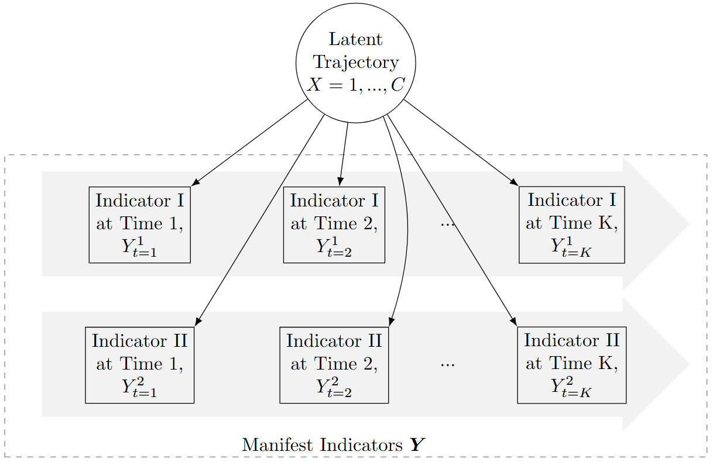

## Authors

- **Weiyi Xia** 
- **Haiqun Lin**

## License

This project is licensed under the MIT License. See the [LICENSE](./LICENSE) file for details.

## SAS_MultiTraj_GBTM
This is the SAS macro that enables the group-based trajectory model with truncated normal measurements.

## Notation
We use letters to denote different variable used in the analysis. 

The likelihood was constructed based on the finite mixture model. We build the likelihood function as

$$P(\boldsymbol{Y})=\sum_{j=1}^J\pi_j\prod_{k=1}^Kp(Y_k=y_k|X=j)$$

## Assumption
Each indicator is assumed to be independent of the equation. $$P(Y_k=y_k|X=j)\perp P(Y_p=y_p|X=j)$$ for any $$k\neq p$$

