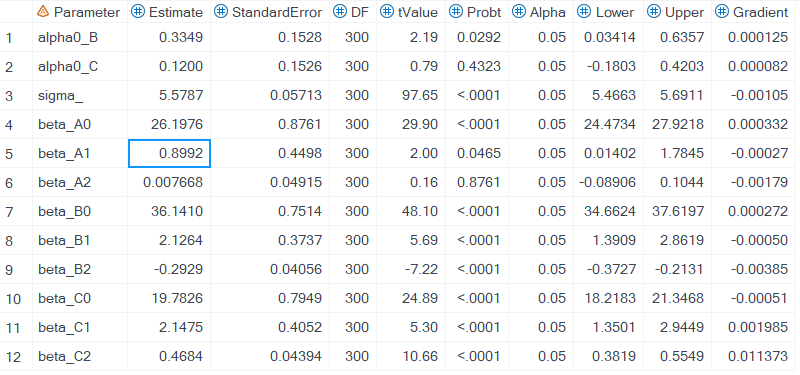
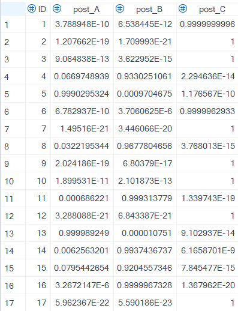

## Authors

- **Weiyi Xia** 
- **Haiqun Lin**

## License

This project is licensed under the MIT License. See the [LICENSE](./LICENSE) file for details.

## Group-Based (Multi-)Trajectory Model
This is the SAS macro that enables the group-based multi-trajectory model with truncated normal measurements. It allows users to perform group-based (multi-)trajectory analysis with (truncated) normal indicators, eliminating the need to install the SAS `PROC TRAJ` procedure.

### Model
#### Notation
We use letters to denote different variables used in the analysis. 
- $X$: A latent class variable representing different clusters based on observed trajectory patterns in the sample. Assume there are a total of $C$ classes, each with distinct trajectories. The variable $X$ can take values $1, 2, \ldots, C$.
- $K$: The number of manifest variable trajectories included in the data analysis. In this SAS macro, it is assumed that $p = 1, 2$ (two trajectories).
- $t$: A time variable specifying the time point at which a measurement is recorded.
- $Y_t^k$: The manifest variable $Y_t^p$ observed at time $k$.

#### DAG

#### Likelihood
The likelihood was constructed based on the finite mixture model. We build the likelihood function as $$P(\boldsymbol{Y})=\sum_{j=1}^J\pi_j\prod_{p=1}^{2}{\prod_{k=1}^Kp(Y_k^p=y_k^p|X=j)}$$.
- The $p(y_k^p|X)$ can vary depending on the assumptions made and the study design. 
  - $p(y_k^p|X)$ can follow a Gaussian distribution if the observed manifest indicator takes a real value.
  - If the indicator is continuous but bounded by lower or upper limits (or both), it may follow a truncated normal distribution.
  - Other commonly used distributional assumptions include a Bernoulli distribution for binary indicators and a Poisson distribution for indicators that take non-negative integer values starting from 0. These two types of indicators are not currently supported in this macro.
- The $\pi_j$ is the proportion part in the finite mixture model. It always follows a multinomial distribution and is constrained by $\sum_j{\pi_j}=1$. This quantity has a meaningful interpretation as the expected proportion of the class assignment.

#### Assumption
- Each indicator is assumed to be independent. $$P(Y_k^p=y_k^p|X=j)\perp P(Y_q^p=y_q^p|X=j)$$ for any $$k\neq q$$

### SAS Macro Manual
%GBTM_SingleTraj(DATA,id,INDEP,VAR,LC,starting,order,equal_sigma,MAX,output,post_group);

#### Macro variable
`DATA` Data file to be analyzed. The current macro supports the use of wide-format data.
`id` ID variable.
`INDEP`=Time_1-Time_8,
`VAR`=Y_1-Y_8,
`LC`=3,
`starting`= %starting_value_alpha(class=3),
`order`=2,
`equal_sigma`=T,
`MAX`=200 200 200 200 200 200 200 200
`output`=res,
`post_group`=post_group
#### Macro Output
`output` Group based trajectory model fitting result. 

`post_group` Predicted posterior group membership.

`data_plot` is generated based on the predicted value for each class and the averaged observation values weighted by the posterior group membership.

`averaged_membership`

### Reference
Jones, B. L., & Nagin, D. S. (2007). Advances in Group-Based Trajectory Modeling and an SAS Procedure for Estimating Them. Sociological Methods & Research, 35(4), 542–571. https://doi.org/10.1177/0049124106292364
