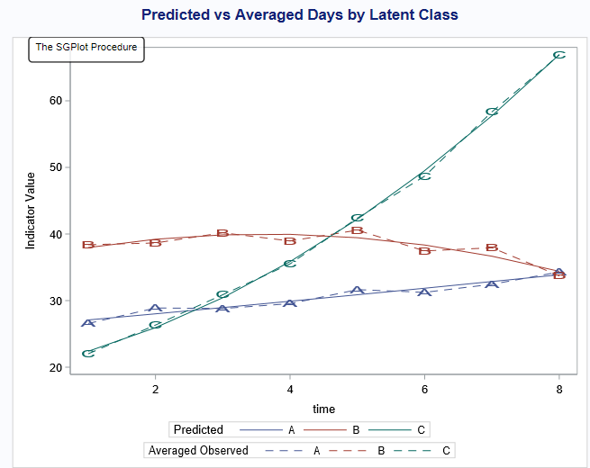
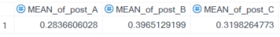

## Authors

- **Weiyi Xia** 
- **Haiqun Lin**

## License

This project is licensed under the MIT License. See the [LICENSE](./LICENSE) file for details.

## Group-Based (Multi-)Trajectory Model
This SAS macro allows users to perform group-based (multi-)trajectory analysis with (truncated) normal indicators without requiring the SAS `PROC TRAJ` procedure.

### Model
#### Notation
We use letters to denote different variables used in the analysis. 
- $X$: A latent class variable representing different clusters based on observed trajectory patterns. There are $C$ distinct classes, with $X$ taking values $1, 2, \ldots, C$.
- $K$: The number of manifest variable trajectories included in the analysis. This SAS macro currently supports $p = 1, 2$ (two trajectories).
- $t$: A time variable indicating when a measurement is recorded.
- $Y_t^k$: The manifest variable $Y$ observed at time $t$ for the $k$th trajectory.

#### DAG

#### Likelihood
The likelihood was constructed based on the finite mixture model. We build the likelihood function as $$P(\boldsymbol{Y})=\sum_{j=1}^J\pi_j\prod_{p=1}^{2}{\prod_{k=1}^Kp(Y_k^p=y_k^p|X=j)}$$.
- $p(y_k^p|X)$ varies based on assumptions and study design:
  - $p(y_k^p|X)$ can follow a Gaussian distribution if the observed manifest indicator takes a real value.
  - If the indicator is continuous but bounded by lower or upper limits (or both), it may follow a truncated normal distribution.
  - Common alternative distributions include Bernoulli (for binary indicators) and Poisson (for non-negative integer indicators starting from 0), though these are not currently supported in this macro
- The parameter $\pi_j$ represents the proportion of class membership in the finite mixture model. It follows a multinomial distribution, constrained by $\sum_j{\pi_j}=1$. This quantity has a meaningful interpretation as the expected proportion of the class assignment.

#### Assumption
- Each indicator is assumed to be independent. $$P(Y_k^p=y_k^p|X=j)\perp P(Y_q^p=y_q^p|X=j)$$ for any $$k\neq q$$
- The joint class probability of each trajectory class is modeled as: $\pi_j=Pr(X=j)$  (to be completed later)

### SAS Macro Manual
`%GBTM_SingleTraj(DATA,id,INDEP,VAR,LC,starting,order,equal_sigma,MAX,output,post_group)`;

#### Macro variable
`DATA`: Data file to be analyzed (wide-format required). e.g., `DATA=wide`. 
`ID`: Identifier variable linking subjects to their predicted group. e.g., `ID=id`. 
`INDEP`: Independent variables. e.g., `INDEP=Time_1-Time_8`. 
`VAR`: Dependent variables. The length of dependent variables and the length of independent variables should match, e.g., `VAR=Y_1-Y_8`. 
`LC`: Number of latent classes in the model. e.g.,`LC=3`. 
`starting=`: Initial values for GBTM iteration. Defaults to 1 if unspecified. e.g., `starting= %starting_value_alpha(class=3) sigma_=10` assigns a starting value of 0 to the proportion estimation for class 3 (indicating equal probability in-class assignment) and the standard deviance of the manifest variable being 10. If not explicitly provided, the default starting value for the model parameters is set to 1.  
`order`: Polynomial order in the structural model (0=intercept, 1=linear, 2=quadratic, 3=cubic). The current program assumes that all classes share the same polynomial value. e.g. `order=2`.  
`equal_sigma`: Whether variances of the manifest indicators is equal (T) or unequal (F) across classes.  
`MAX`: Upper bounds for truncated normal distribution. e.g. `MAX=200 200 200 200 200 200 200 200`.  

The following statements describe how to save the results: 
`output` datafile name of the GBTM parameter coefficients estimation output. 
`post_group` datafile name of the predicted posterior group membership after the model fitting.  
#### Macro Output
`output`: SAS file containing estimated model parameters.  
 
`post_group`: SAS file with predicted posterior group membership. 
 

`data_plot`: A visualization of predicted values per class and average observations weighted by posterior group membership. 
 

`Summary`: shows the summary statistics for model fitting, including class membership counts and prior/posterior probabilities. Model evaluation metrics include: the average posterior probability of assignment (APPA), odds of correct classification (OCC). 
 
 

### Reference
- Jones, B. L., & Nagin, D. S. (2007). Advances in Group-Based Trajectory Modeling and an SAS Procedure for Estimating Them. Sociological Methods & Research, 35(4), 542–571. https://doi.org/10.1177/0049124106292364 
- Klijn SL, Weijenberg MP, Lemmens P, van den Brandt PA, Lima Passos V. Introducing the fit-criteria assessment plot – A visualisation tool to assist class enumeration in group-based trajectory modelling. Statistical Methods in Medical Research. 2017;26(5):2424-2436. doi:10.1177/0962280215598665
